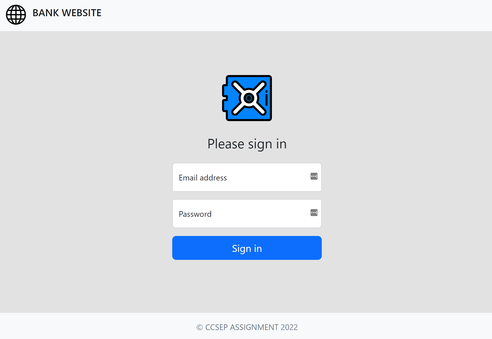
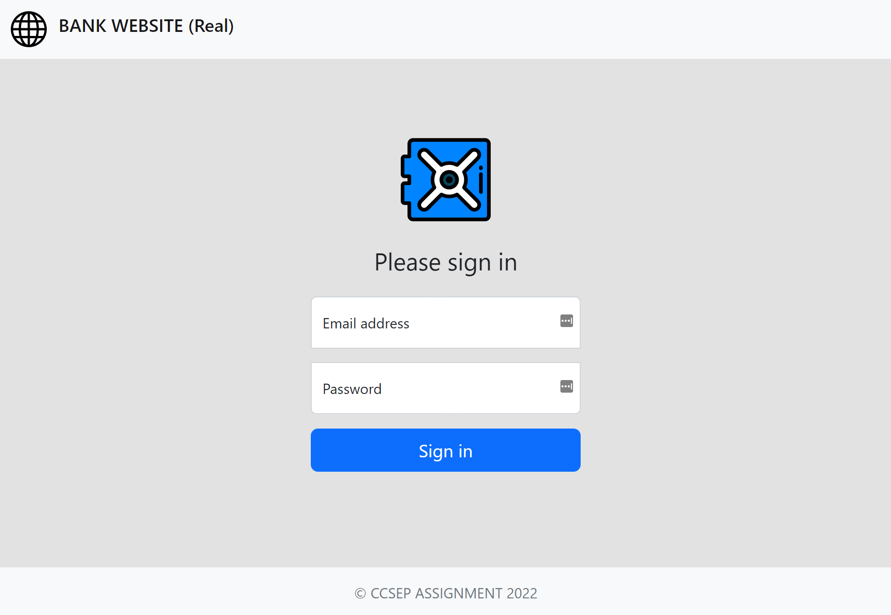

# Backend Systems

- The backend system runs on docker-compose with 3 containers and are summarised below :

<br/>

#### Container 1 [**FakeWebsite**] <br> 
- A web server that imitates the login system for the bank website.



<br/>

#### Container 2 [**RealWebsite**] <br> 
- A web server that provides a login system for the real bank website.


<br/>

#### Container 3 [**HackerServer**] <br> 
- A web server that provides a user interface for displaying the stolen credentials.


</br>

## Pre-requisite

- Download and install docker desktop: [Docker Desktop](https://www.docker.com/products/docker-desktop/ ) 
- Download and use the vulnerable browser: [Github](https://github.com/amaan-seetal/Unicode_Spoofing_Demo_Vulnerable_Browser)

- Edit the host file of your operating system and enter the following:

```
127.0.0.1 bankwebsite.com
127.0.0.1 bаnkwebsite.com
```
NOTE:
For Windows, the host file is located by default in "C:\Windows\System32\drivers\etc"

</br>

## Usage (with Hyper-V)

1. Open Docker Desktop
2. Go to Settings > Resources > File-sharing
3. Add the root directory to the list
3. Open a terminal in the root directory and run the following command:

```
    docker-compose up
```

</br>

## Usage (with WSL)

1. Open Docker Desktop
2. Open a terminal in the root directory and run the following command:

````
    docker-compose up
````

</br>

## Servers Access
The web servers should boot up and will be available at the following addresses:

- Fake website:  http://localhost:4500/
- Real website:  http://localhost:4400/
- Api server  :  http://localhost:4600/